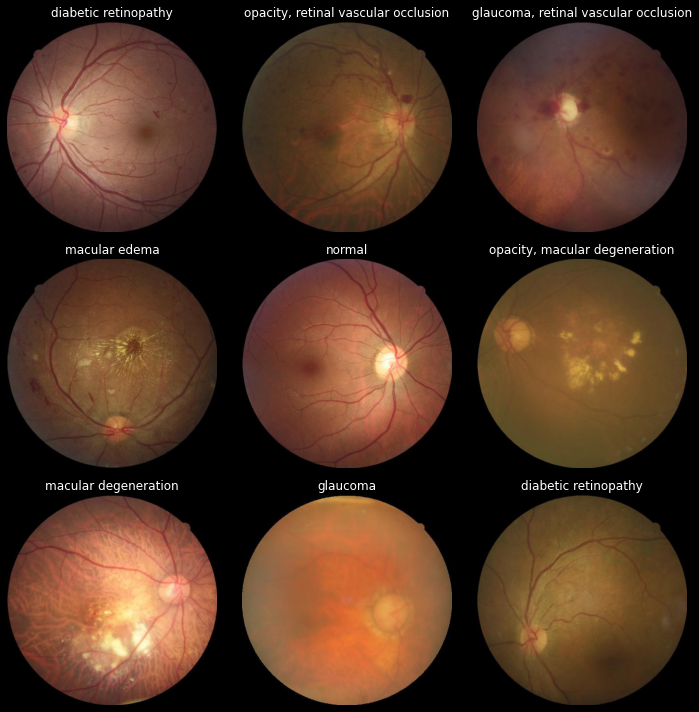

### Machine Learning Applications in Healthcare
# Deep Learning for Fundus Image Classification
*Daimon Laplace*

 

# Contents
1. [Introduction](#introduction)
2. [Method](#method)
3. [Tools](#tools)
4. [Dataset and Exploratory Data Analysis](#dataset-and-exploratory-data-analysis)
5. [Tasks](#tasks)
6. [Preprocessing](#preprocessing)
7. [Augmentation](#augmentation)
8. [Anomaly Detection](#anomaly-detection)
9. [Multi-Class and Multi-Label Classificationation](#multi-class-and-multi-label-classification)
10. [Results](#results-and-conclusion)
11. [What comes next](#what-comes-next)
12. [References](#references)

 
 

# Introduction
In this project i will try to predict, if a fundus image shows an abnormality or not. I also will see, if I can predict multiple classes and labels. 
 
 

# Method
I used the dataset to try and predict if an image would show an anomaly. The Images were augmented and different colorschemes were tried. As the results with a simple Cnn Model were good.
Next, I tried to predict multiple classes, as the results with a simple CNN were not that great, I decided to use a pretrained Model, the VGG-16. 
Last I wanted to see, if it was possible to predict multiple classes in one image, a multi-label classification. This can be done by merely changing the last layer of the Model and it's activation function. 

- Collect information on the field of Funduns Images,Illnesses, Epidemiology, for Benchmarking and Orientation
- decision on tasks, metrics, tools and methods
- Exploration of Dataset
- Preprocessing of data
- Augmentation of data
- Building a Keras Image Generator
- Experiments: Train Model on various Variants of  Architecture and Hyperparameters and Data
- Summarize Results

 
 

# Tools 
For the exploration, preprocessing and deep learning application a ver of different tools were used. Some of the work was done locally on a desktop computer, deep learning was done in the cloud. Herefore i mostly used Google Colab until I ran into some memory issues and switched to Google CLoud Platform.

- Cloud Computing: Google Colab, Paperspace, Google Cloud Platform
- Data Exploration, Manipulation and Visualization: Python, NumPy, Pandas, Matplotlib
- Preprocessing&Augmentation: OpenCV, PIL, Pillow, Scikit-Image, KerasImageGenerator
- Deep Learning: Keras, Tensorflow

 
 

# Dataset and Exploratory Data Analysis
The dataset includes 3,285 images from CTEH (3.210 abnormals and 75 normals) and 500 normal images from Messidor and EYEPACS dataset. The abnormalities include: opacity, diabetic retinopathy, glaucoma, macular edema, macular degeneration, and retinal vascular occlusion.
 

Source 
https://www.kaggle.com/c/vietai-advance-retinal-disease-detection-2020/data

Some Abnormalities occur together. In roughly half of the cases there are 2 or more Abnormalities occuring together. 
There are Cases, in which up to 4 Abnormalities occur together. It will be interesting to see, if the Machine can find all of them.  These images could be used in a multi-label classification. 
 

## Diabetic Retinopathy
Affects Blood vessels in the retina. Learding cause of vision impairment and blindness. Important features for detection are Blood vessels, exudates, hemorrhages, micro aneurysms.
Cause: Diabetes
 

## Opacity
Corneal opacity is a disorder of the cornea. The cornea is the transparent structure on the front of the eyeball. Corneal opacity occurs when the cornea becomes scarred. This stops light from passing through the cornea to the retina and may cause the cornea to appear white or clouded over.
 

## Glaucoma
Fluid buildup in the eye causes an increase in eye pressure that damages the optic nerve.
 

## Macular Edema
Collection of fluid deposits on or under the macula. This will cause the macula to thicken and swell and distort the vision of a person. It is often associated with diabetes but can also be caused by age-related macular degeneration. 
 

## Macular Degeneration
Degeneration of the macula. Is mostly age-related, but risk will be higher, if patient is a smoker or has a high cholesterol. 
 

## Retinal Vascular Occlusion
Retinal vein occlusions occur when there is a blockage of veins carrying  blood with needed oxygen and nutrients away from the nerve cells in the retina. A blockage in the retina’s main vein is referred to as a central retinal vein occlusion (CRVO), while a blockage in a smaller vein is called a branch retinal vein occlusion (BRVO).
 
 

# Preprocessing
Make important features pop out with changing of colors. 
Cropping and Resizing of images.

Color Variants
•	Original Color
•	Greyscale
•	Preprocessing for VGG-16
•	Substracting local average color
 
 

# Augmentation
Make more data, to adress class imbalance
It might be possible to adress imbalance by only balancing the instances with merely one abnormality in the image. After running into various issues with memory while transforming the images to array with numpy, I decided to go with KerasImageGenerator. 
While I still had to balance the data manually, it was perfect for reading in Images in a memory friendly way. 

 
 

# Anomaly Detection
Used a simple CNN similar to VGG-16, a convolutional neural network model proposed by K. Simonyan and A. Zisserman from the University of Oxford in the paper “Very Deep Convolutional Networks for Large-Scale Image Recognition”.

After first succesfull implementation I tried a to tune some hyperparameters with the Keras Tuner. 
 
 

# Multi-Class and Multi-Label Classification
Multiclass Classification. Selected most prevalent illnesses in dataset. 
As Classes are balanced, I will go with Accuracy in training as it is an intuitive and simple to understand metric. 
As the results with a simple CNN were not that great, I used the afore mentioned VGG-16 and fine tuning.

*Source: https://blog.keras.io/img/imgclf/vgg16_modified.png*

 
 

# Results and what comes next
To predict an anomaly from fundus images is easy to solve, but multi-class and multi-label predictions proved to be more complex. Next, I will try:

1.	More data
2.	Different Preprocessing
3. Address not only imbalance in cases but also in labels

 
 

# Thank you!
 
Mia, Eike, Simon, Anne, Torsten, Chris, Karl, Julia, Boris, Rainer, Juan, Adrian, Burak, Fidel, Matthias, Mario, Christian, Jaouad, Yusuf! I wish you all the best!  
 
I learned so much and had a great time!
Now, I will go on... and learn some more ;)

 
 

# References
Here some of the Books, Papers and Articles I read and Videos I watched in Preparation for my Project and Links to Websites which were very helpful in resolving issues and how-tos.

## Language, Libraries
https://www.python.org/ 
https://jupyter.org/ 
https://www.anaconda.com/ 
https://www.tensorflow.org/ 
https://keras.io/ 
https://matplotlib.org/ 
https://pandas.pydata.org/ 

 

## Sources for descriptions of Diseases

https://biomedical-engineering-online.biomedcentral.com 
https://www.kceyeclinic.com 
https://uvahealth.com 
https://www.asrs.org 
https://entokey.com/retina-4/ 
https://www.atlasophthalmology.net/ 

## Fundus Images with a mobile phone
Fundus Bilder sind Bilder der Netzhaut. Bislang wurden diese mit einer speziellen Kamera, der Fundus Kamera erstellt es wurden inzwischen jedoch auch Methoden entwickelt, um diese Bilder mit dem Handy machen zu können. Diese dann im selben Zug zu analysieren um eine Diagnose zu stellen, bedeutet einen großen Fortschritt in der Bekämpfung von Blindheit weltweit. 

https://journals.lww.com/ijo/Fulltext/2014/62090/Fundus_imaging_with_a_mobile_phone__A_review_of.16.aspx#:~:text=Fundus%20imaging%20with%20a%20fundus,coupled%20with%20a%20condensing%20lens.

 

## Transfer learning
Karen Simonyan, Andrew ZissermanVery Deep Convolutional Networks for Large-Scale Image Recognition 
https://arxiv.org/abs/1409.1556

 

## Image Preprocessing and Augmentation

Make a histogram of color channels  
https://towardsdatascience.com/histograms-in-image-processing-with-skimage-python-be5938962935 

OpenCV 
https://opencv.org/ 

Pillow 
https://pillow.readthedocs.io/en/stable/handbook/tutorial.html 

DMENet: Diabetic Macular Edema diagnosis using Hierarchical Ensemble of CNNs
https://journals.plos.org/plosone/article?id=10.1371/journal.pone.0220677

Deep Learning on Retina Images as Screening Tool for Diagnostic
Decision Support
https://arxiv.org/ftp/arxiv/papers/1807/1807.09232.pdf 
 

## Literature about AI in Healthcare

Deep Medicine by Eric Topol 
https://www.goodreads.com/book/show/40915762-deep-medicine

 

## Interesting Talks 
https://www.youtube.com/watch?v=ViSfhPE6q6Q&list=PL32IFKvW53Vg-gM2mq-tjF6edBqoTV_ie&index=5

https://www.youtube.com/watch?v=pMGLFlgqxuY&list=PL32IFKvW53Vg-gM2mq-tjF6edBqoTV_ie&index=3

https://www.youtube.com/watch?v=UZEstizNxkg&list=PL32IFKvW53Vg-gM2mq-tjF6edBqoTV_ie&index=1

 

## My Website
I have written about Data Science and worked on some projects, which can be found here:
http://patternrecognition.tech/
